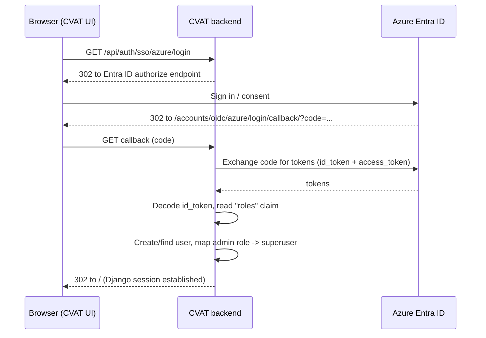

# CVAT Single Sign-On with Microsoft Azure Entra ID

This document explains the changes that replace CVAT's username/password ("basic")
authentication with **Single Sign-On (SSO)** backed by **Microsoft Azure Entra ID**
(formerly Azure AD) using **OpenID Connect (OIDC)**, and how to build and run it on
**K3s**.

Role mapping:

| Entra ID app role assigned to the user | CVAT access level                         |
| -------------------------------------- | ----------------------------------------- |
| `admin` (configurable)                 | **Super admin** (Django `is_superuser`)   |
| any other role / no admin role         | **Regular user** (default "user" group)   |

Entra ID is the source of truth: a user's CVAT privileges are recomputed from their
Entra ID app roles on every login.

---

## 1. What was changed in the code

### Backend (Django, `cvat/apps/iam`)

| File | Change |
| ---- | ------ |
| `cvat/apps/iam/sso.py` *(new)* | OIDC adapter that reads Entra ID **app roles** from the ID token, a social-account adapter that auto-provisions users and applies role mapping, the role-sync logic, the login/callback views and the `/api/auth/sso/azure/login` redirect endpoint. |
| `cvat/apps/iam/sso_urls.py` *(new)* | URL patterns for the OIDC `login`/`callback` and allauth social support views. |
| `cvat/settings/base.py` | New `SSO_*` settings driven by environment variables; configures the allauth `openid_connect` provider for Entra ID; can disable basic login. |
| `cvat/apps/iam/urls.py` | Basic login / registration / password endpoints are now only registered when basic login is enabled. Adds the `/api/auth/sso/azure/login` route. |
| `cvat/apps/iam/apps.py` | Registers the SSO signal handlers when SSO is enabled. |
| `cvat/urls.py` | Mounts the SSO/allauth URLs when SSO is enabled. |

No new Python dependencies are required — `django-allauth` (already pinned in
`cvat/requirements/base.txt`) ships the generic OpenID Connect provider.

### Frontend (`cvat-ui`)

| File | Change |
| ---- | ------ |
| `cvat-ui/src/reducers/server-api-reducer.ts` & `reducers/index.ts` | Detect SSO availability from the API schema (`/api/auth/sso/azure/login`). |
| `cvat-ui/src/containers/login-page/login-page.tsx` | Provide the SSO login URL and the `isSSOEnabled` flag. |
| `cvat-ui/src/components/login-page/login-page.tsx` & `login-form.tsx` | Render a **"Sign in with Microsoft"** button. |
| `cvat-ui/src/components/signing-common/styles.scss` | Styling for the SSO button / divider. |

The login page automatically hides the username/password form when basic login is
disabled on the server, because the UI keys off the presence of the
`/api/auth/login` endpoint in the API schema.

### Environment variables

| Variable | Required | Default | Description |
| -------- | -------- | ------- | ----------- |
| `CVAT_SSO_ENABLED` | yes | `false` | Master switch for the integration. |
| `CVAT_SSO_AZURE_TENANT_ID` | yes (when enabled) | – | Directory (tenant) ID. |
| `CVAT_SSO_AZURE_CLIENT_ID` | yes (when enabled) | – | Application (client) ID. |
| `CVAT_SSO_AZURE_CLIENT_SECRET` | yes (when enabled) | – | Client secret **value**. |
| `CVAT_SSO_ADMIN_ROLES` | no | `admin` | Comma-separated Entra ID app-role values that grant CVAT super admin. |
| `CVAT_SSO_DISABLE_BASIC_LOGIN` | no | `false` | When `true`, removes username/password login & registration. |
| `CVAT_SSO_CONNECT_BY_EMAIL` | no | `true` | Link an SSO identity to a pre-existing local account with the same e-mail. |
| `CVAT_SSO_AZURE_PROVIDER_ID` | no | `azure` | Internal provider id (affects the callback URL path). |
| `CVAT_HOST` | yes | `localhost` | Public hostname; must match the redirect URI registered in Entra ID. |

---

## 2. Configure the app registration in Azure Entra ID

1. **Azure Portal → Entra ID → App registrations → New registration**
   * Name: `CVAT`
   * Supported account types: *Accounts in this organizational directory only* (single tenant).
   * Redirect URI: **Web** →
     `https://<CVAT_HOST>/accounts/oidc/azure/login/callback/`
     (e.g. `https://cvat.example.com/accounts/oidc/azure/login/callback/`).
     > The path is `oidc/<CVAT_SSO_AZURE_PROVIDER_ID>/login/callback/`. With the
     > default provider id `azure` it is `oidc/azure/login/callback/`.

2. Note the **Application (client) ID** and **Directory (tenant) ID** from the
   *Overview* page.

3. **Certificates & secrets → New client secret** → copy the secret **Value**
   (not the Secret ID). This is `CVAT_SSO_AZURE_CLIENT_SECRET`.

4. **Token configuration → Add optional claim → ID** → add `email` (and `upn` if
   you want it as a fallback). This ensures CVAT receives an e-mail address.

5. **App roles → Create app role** — create at least two roles:

   | Display name | Allowed member types | Value   | Description           |
   | ------------ | -------------------- | ------- | --------------------- |
   | Admin        | Users/Groups         | `admin` | CVAT super admin      |
   | User         | Users/Groups         | `user`  | Regular CVAT access   |

   The **Value** column is what CVAT matches against `CVAT_SSO_ADMIN_ROLES`.

6. **Enterprise applications → CVAT → Users and groups → Add user/group** and
   assign each person (or a group) the `Admin` or `User` app role.
   > App roles are emitted in the `roles` claim of the ID token only for users who
   > have an assignment. Users with no assignment are treated as regular users
   > (and, if you require an assignment, Entra ID can block them at sign-in via
   > *Properties → Assignment required = Yes*).

---

## 3. Build the custom images

The SSO logic lives in source, so you must build and push your own server and UI
images.

```bash
# from the repository root
export REGISTRY=<your-registry>          # e.g. ghcr.io/acme or myacr.azurecr.io
export TAG=sso

# Backend (Django server + workers use the same image)
docker build -t "$REGISTRY/cvat-server:$TAG" -f Dockerfile .

# Frontend (React UI served by nginx)
docker build -t "$REGISTRY/cvat-ui:$TAG" -f Dockerfile.ui .

docker push "$REGISTRY/cvat-server:$TAG"
docker push "$REGISTRY/cvat-ui:$TAG"
```

---

## 4. Run locally with Docker Compose (quick validation)

Before going to K3s you can validate the flow locally:

```bash
export CVAT_HOST=localhost

cat > docker-compose.sso.yml <<'EOF'
services:
  cvat_server:
    environment:
      CVAT_SSO_ENABLED: "true"
      CVAT_SSO_DISABLE_BASIC_LOGIN: "false"
      CVAT_SSO_ADMIN_ROLES: "admin"
      CVAT_SSO_AZURE_TENANT_ID: "<tenant-id>"
      CVAT_SSO_AZURE_CLIENT_ID: "<client-id>"
      CVAT_SSO_AZURE_CLIENT_SECRET: "<client-secret>"
  cvat_worker_import: &sso { environment: *id001 }
EOF

# Register http://localhost:8080/accounts/oidc/azure/login/callback/ as an extra
# redirect URI in Entra ID for local testing.
docker compose -f docker-compose.yml -f docker-compose.dev.yml -f docker-compose.sso.yml up -d
```

Open `http://localhost:8080`, click **Sign in with Microsoft**, and confirm you
land in CVAT. A user assigned the `admin` app role should see the Django admin /
organization-management capabilities of a super admin.

> Simpler alternative: put the `CVAT_SSO_*` variables in a `.env` file / export
> them and add them to the `cvat_server` and all `cvat_worker_*` services. Every
> backend container must receive the same SSO variables.

---

## 5. Deploy on K3s

These steps use the bundled Helm chart in `./helm-chart`.

### 5.1 Create the namespace and the SSO secret

```bash
kubectl create namespace cvat

cp k8s/sso/cvat-sso-secret.example.yaml /tmp/cvat-sso-secret.yaml
# edit /tmp/cvat-sso-secret.yaml -> fill tenant_id / client_id / client_secret
kubectl -n cvat apply -f /tmp/cvat-sso-secret.yaml
```

### 5.2 Point the chart at your images and enable SSO

Edit `k8s/sso/cvat-sso.values.yaml`:

* set `cvat.backend.image` / `cvat.frontend.image` to your registry images and tag;
* keep `CVAT_SSO_DISABLE_BASIC_LOGIN=false` for the first deployment.

If you use a private registry, also create an image pull secret and reference it
via the chart's `imagePullSecrets` value.

### 5.3 Install / upgrade

```bash
helm dependency update ./helm-chart

helm upgrade --install cvat ./helm-chart \
  --namespace cvat \
  -f my-base.values.yaml \
  -f k8s/sso/cvat-sso.values.yaml \
  --set cvat.backend.additionalEnv[100].name=CVAT_HOST \
  --set cvat.backend.additionalEnv[100].value=cvat.example.com
```

> `my-base.values.yaml` is your normal CVAT chart configuration (ingress host,
> TLS, Postgres, storage, etc.). Make sure the ingress host equals `CVAT_HOST`
> and that the redirect URI registered in Entra ID is
> `https://<CVAT_HOST>/accounts/oidc/azure/login/callback/`.

### 5.4 TLS / proxy notes

* CVAT already sets `SECURE_PROXY_SSL_HEADER=("HTTP_X_FORWARDED_PROTO","https")`
  and `USE_X_FORWARDED_HOST=True`. Ensure your Traefik/NGINX ingress forwards the
  `X-Forwarded-Proto` and `X-Forwarded-Host` headers so the OAuth callback URL is
  generated as `https://<CVAT_HOST>/...` and matches Entra ID.
* Add your public host to `ALLOWED_HOSTS` (env var) if it is not already covered.

### 5.5 Verify

```bash
kubectl -n cvat get pods
kubectl -n cvat logs deploy/cvat-backend-server | grep -i sso
```

Browse to `https://<CVAT_HOST>`, you should see the **Sign in with Microsoft**
button. Sign in with an admin-role account and confirm super-admin access, then
with a regular account and confirm standard access.

### 5.6 Make Entra ID the only login method

Once SSO works, lock down basic login by setting on the backend:

```yaml
- name: CVAT_SSO_DISABLE_BASIC_LOGIN
  value: "true"
```

and `helm upgrade` again. The username/password form disappears automatically and
the `/api/auth/login`, `/api/auth/register`, and password endpoints stop being served.

---

## 6. How it works



* Azure puts **app roles** in the **ID token's `roles` claim** (the OIDC
  *userinfo* endpoint does not return them), so `EntraOIDCAdapter.complete_login`
  decodes the ID token to obtain the roles.
* `sync_sso_user_roles` promotes users with an admin role to Django
  `is_superuser`/`is_staff` and adds them to the CVAT `admin` group; everyone else
  is placed in the default `user` group. This runs on first login and whenever the
  user's roles change in Entra ID.

---

## 7. Troubleshooting

| Symptom | Likely cause / fix |
| ------- | ------------------ |
| `redirect_uri_mismatch` (AADSTS50011) | The redirect URI in Entra ID must exactly equal `https://<CVAT_HOST>/accounts/oidc/azure/login/callback/`. Check `CVAT_HOST` and ingress `X-Forwarded-Proto`. |
| Callback URL is `http://` not `https://` | Ingress is not forwarding `X-Forwarded-Proto: https`. |
| Admins are not getting super-admin rights | The app role **Value** must be in `CVAT_SSO_ADMIN_ROLES`, and the user must be **assigned** that app role in *Enterprise applications → Users and groups*. |
| `ImproperlyConfigured: CVAT_SSO_ENABLED is set ...` | One of tenant/client id/secret env vars is missing on the backend pods. |
| User created without e-mail | Add the optional `email` claim in *Token configuration* of the app registration. |
| Locked out after disabling basic login | Re-enable basic login (`CVAT_SSO_DISABLE_BASIC_LOGIN=false`) and use the local superuser, or `kubectl exec` into the server pod and run `python manage.py changepassword <user>`. |
